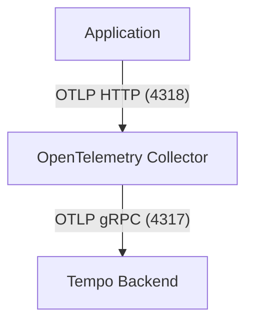

# Welysn OpenTelemetry Collector

This project provides a containerized OpenTelemetry Collector setup for forwarding trace data to a remote Tempo backend. It uses Docker Compose for orchestration and is designed for easy integration into distributed tracing architectures.

## Architecture Overview

The architecture consists of the following components:

- **OpenTelemetry Collector**: Receives trace data via OTLP HTTP, processes it in batches, and exports it to a remote Tempo instance.
- **Tempo Backend**: (External, not included in this repo) Receives and stores trace data for querying and analysis.

### Data Flow

1. Applications send OTLP traces to the Collector on port `4318` (HTTP).
2. The Collector batches and forwards traces to the Tempo backend at `welysn-tempo:4317` using OTLP gRPC.

### Mermaid Diagram



## File Descriptions

- `collector-config.yaml`: Configuration for the OpenTelemetry Collector, defining receivers, processors, exporters, and pipelines.
- `docker-compose.yml`: Docker Compose file to run the Collector container with the correct configuration and port mapping.
- `Dockerfile`: (Optional) Custom Dockerfile for building a Collector image with the provided configuration.

## Usage

### Prerequisites
- Docker and Docker Compose installed
- Access to a Tempo backend (update the `endpoint` in `collector-config.yaml` if needed)

### Steps

1. **Start the Collector**
   ```sh
   docker-compose up -d
   ```

2. **Send Traces**
   Configure your application to send OTLP traces to `http://localhost:4318`.

3. **Verify**
   The Collector will forward traces to the configured Tempo backend.

## Configuration Details

### collector-config.yaml
- **Receivers**: Accepts OTLP traces over HTTP (`0.0.0.0:4318`).
- **Processors**: Batches traces for efficient export.
- **Exporters**: Sends traces to Tempo at `welysn-tempo:4317` (insecure TLS).
- **Service Pipeline**: Connects receivers, processors, and exporters for trace data.

---

For more information, see the [OpenTelemetry Collector documentation](https://opentelemetry.io/docs/collector/).
