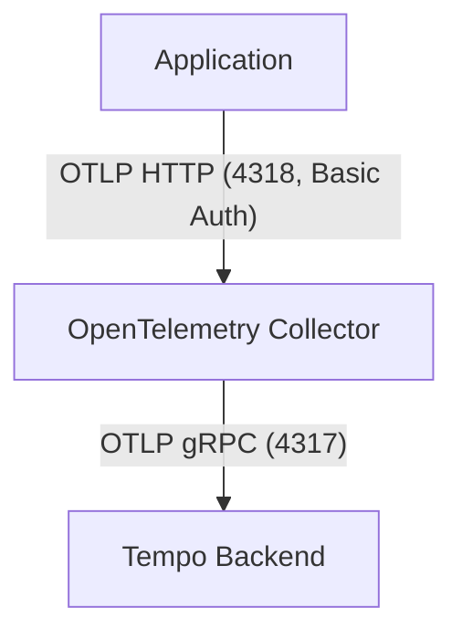

# Welysn OpenTelemetry Collector

This project provides a containerized OpenTelemetry Collector setup for forwarding trace data to a remote Tempo backend. It uses Docker Compose for orchestration and is designed for easy integration into distributed tracing architectures. The collector is secured with basic authentication for incoming trace data.

## Architecture Overview

The architecture consists of the following components:

- **OpenTelemetry Collector**: Receives trace data via OTLP HTTP (secured with basic auth), processes it in batches, and exports it to a remote Tempo instance.
- **Tempo Backend**: (External, not included in this repo) Receives and stores trace data for querying and analysis.

### Data Flow

1. Applications send OTLP traces to the Collector on port `4318` (HTTP) with basic authentication.
2. The Collector batches and forwards traces to the Tempo backend at `welysn-tempo:4317` (assuming the infra is railway.com) using OTLP gRPC.

### Mermaid Diagram



## File Descriptions

- `collector-config.yaml`: Configuration for the OpenTelemetry Collector, including basic authentication, receivers, processors, exporters, and pipelines.
- `docker-compose.yml`: Docker Compose file to build and run the Collector container with the correct configuration, port mapping, and environment variables.
- `Dockerfile`: Custom Dockerfile for building a Collector image with the provided configuration.
- `.env` / `.env.example`: Environment variable for basic authentication credentials.
- `trace.json`: Example trace payload for testing the collector endpoint.

## Usage

### Prerequisites
- Docker and Docker Compose installed
- Access to a Tempo backend (update the `endpoint` in `collector-config.yaml` if needed)
- Set up your `.env` file (see `.env.example`)

### Steps

1. **Start the Collector**
   ```sh
   docker-compose up -d
   ```

2. **Send Traces**
   Configure your application to send OTLP traces to `http://localhost:4318` using basic authentication.

3. **Verify**
   The Collector will forward traces to the configured Tempo backend.

## Configuration Details

### collector-config.yaml
- **Extensions**: Enables basic authentication using credentials from the environment variable `BASIC_AUTH_HTPASSWD`.
- **Receivers**: Accepts OTLP traces over HTTP (`0.0.0.0:4318`) with basic auth.
- **Processors**: Batches traces for efficient export.
- **Exporters**: Sends traces to Tempo at `welysn-tempo:4317` (insecure TLS).
- **Service Pipeline**: Connects receivers, processors, and exporters for trace data.
- **Telemetry**: Collector logs are set to debug level for troubleshooting.

## Testing the Collector

You can test the OTLP HTTP endpoint using the provided `trace.json` and your basic auth credentials:

```sh
curl -v http://localhost:4318/v1/traces \
  -u <basic-auth-username>:<basic-auth-password> \
  -H "Content-Type: application/json" \
  --data-binary @trace.json
```

Replace `<basic-auth-username>` and `<basic-auth-password>` with the values from your `.env` file.

---

For more information, see the [OpenTelemetry Collector documentation](https://opentelemetry.io/docs/collector/).
